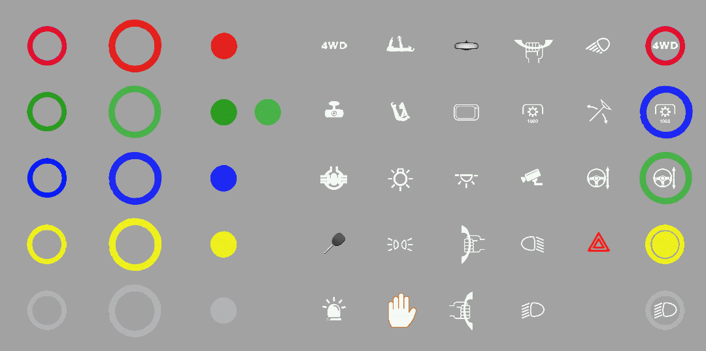
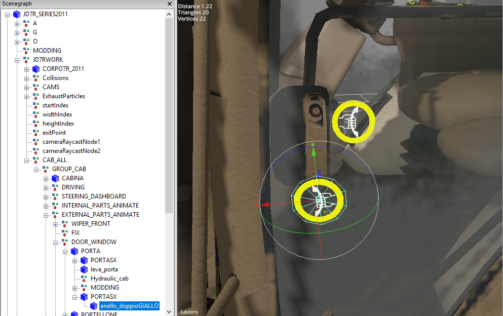

# Setting up I3D button

Here you can find informations about how set I3D button properly for IC.

## What you will need

First of all, you will need some I3D button. I'd recomend that one in Interactive Control release. These buttons have different colors and contain full set of common icons that can be found in mods. This set was created by [Ago-Systemtech (Modhoster Team)](https://www.fb.com/ago.systemtech). You can use this set of icons and colors non commercialy.

## I'm using oficial icon set

If you want to use oficial icon set, you can simply copy content of `ICButton` folder from release into you mod's directory. Then import `ICButtons.i3d` into you mod's i3d file. After that, you can combine variety of rings and icons together. Just be sure result is in correct form: ring is parent element of icon (because of pulsing marks).

## I want to use my icons

If you for some reason don't want or can't use this set of icons, you can create your own. For IC you will need some outer ring and inner icon. This because of pulsing marks. (Read about them in documentation of concrete component). Shape of ring and icon is not limited.

## I'm in mod's i3d model...

If you have IC button created and inserted into your mod, place it where you want to have IC button. But make sure, that animation, visibility button, etc... will interact properly with this button. For example: If you have button for controling doors, you probably will want to button _stick_ to this doors. This correct placing can be seen on this example:

## Buttons are visible...

Buttons in model can be visible - script will hide all buttons after start. If some button stay visible after mod load it indicated that this button is not load into IC.

Do not be afraid that buttons are visible in raw i3d model...

## Thats all

That is all for this tutoria. You can visit another tutorials [here](../tutorials.md)
